# 📊 Dashboard de Analítica Financiera y Riesgo de Liquidez  
## Caso de Estudio en Data Science – ACUAMAR S.A.

  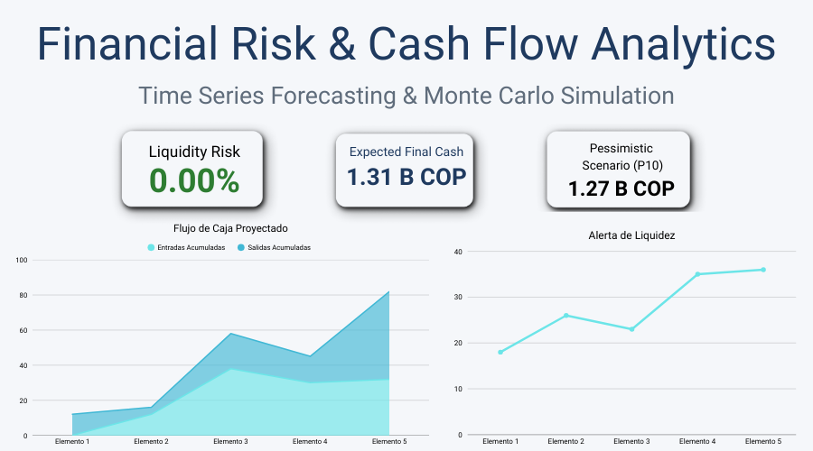

  <b>Análisis Exploratorio (EDA)</b> · <b>Pronóstico de Series de Tiempo</b> · <b>Simulación de Riesgo</b> · <b>Analítica Financiera</b>

---

## 🎯 Resumen Ejecutivo

  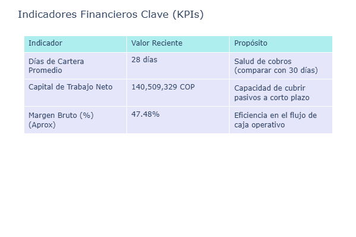

  <b>Capital de Trabajo Neto:</b> 140,509,329 COP &nbsp;|&nbsp;
  <b>Margen Bruto:</b> 47.48% &nbsp;|&nbsp;
  <b>Días de Cartera:</b> 28

---

## 🧠 Problema de Negocio

  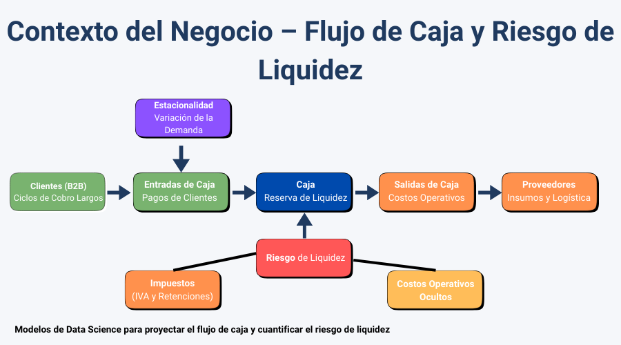

**Objetivo:**  
Predecir el flujo de caja y cuantificar el riesgo de liquidez en una empresa industrial B2B, considerando estacionalidad, costos operativos ocultos y obligaciones fiscales.

---

## 📂 Descripción del Dataset

  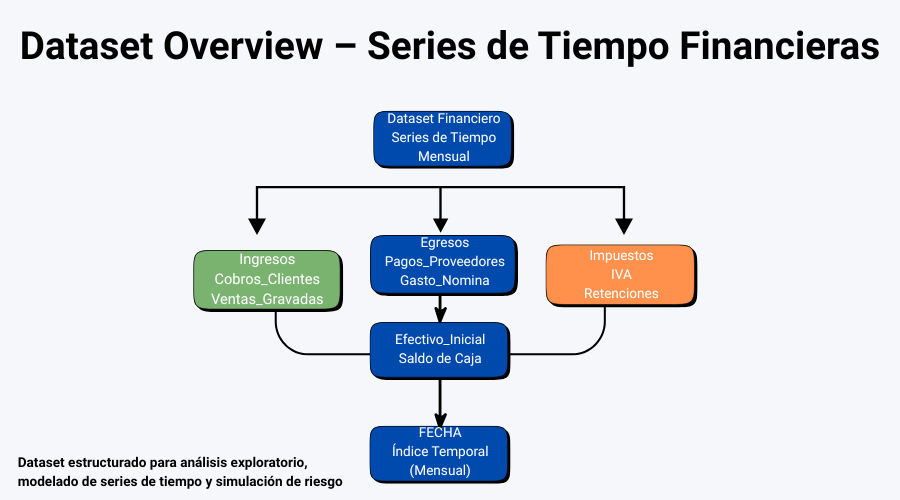

| Variable | Descripción |
|--------|-------------|
| FECHA | Índice temporal (mensual) |
| Cobros_Clientes | Entradas de caja |
| Pagos_Proveedores | Salidas de caja |
| Efectivo_Inicial | Liquidez inicial |
| Ventas_Gravadas | Base gravable de IVA |
| Gastos_Gravados | IVA descontable |
| Base_Retencion | Retenciones aplicables |
| Gasto_Nomina | Costos laborales |

---

## 🔍 Análisis Exploratorio de Datos (EDA)

### Dinámica Histórica del Flujo de Caja

  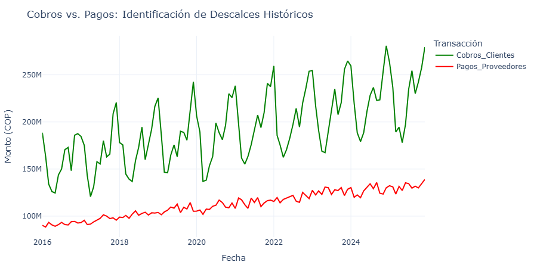

*Análisis de descalces históricos entre ingresos y egresos.*

---

### Alertas de Liquidez

  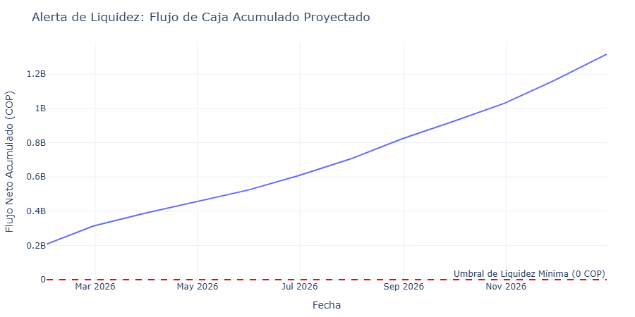

*Validación del umbral mínimo de liquidez y detección temprana de riesgos.*

---

## 📈 Pronóstico del Flujo de Caja (Prophet)

  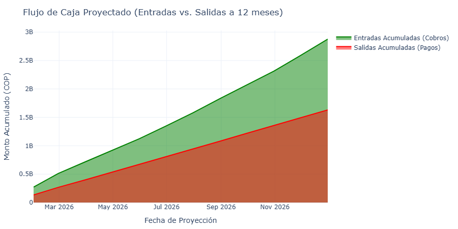

*Proyección de entradas y salidas acumuladas a un horizonte de 12 meses.*

---

## 🧾 Pronóstico y Control de Impuestos

  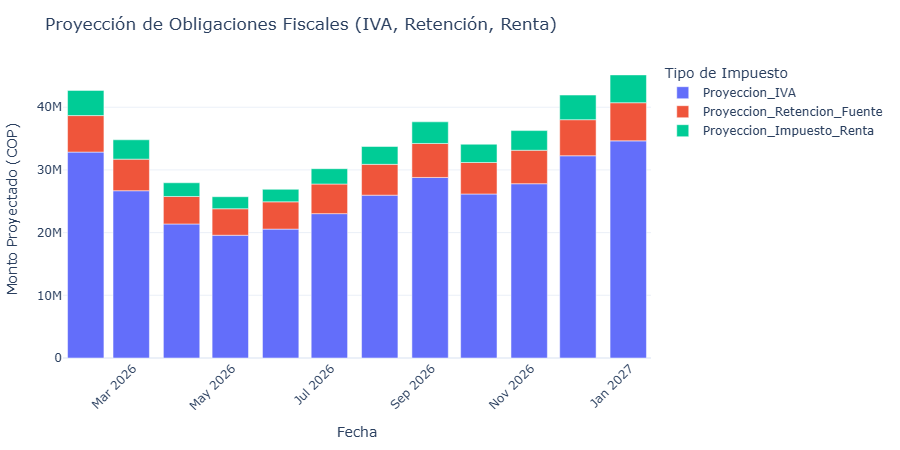

*Estimación mensual de IVA, retenciones e impuesto de renta para control fiscal.*

---

## 📉 Dashboard de Riesgo Financiero  
### ARIMA + Simulación Monte Carlo

  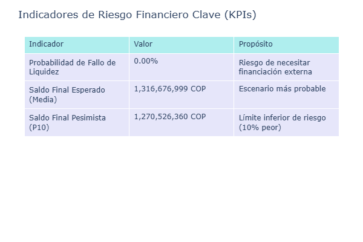

  <b>Probabilidad de Fallo de Liquidez:</b> 0.00% &nbsp;|&nbsp;
  <b>Saldo Final Esperado:</b> 1.316 B COP &nbsp;|&nbsp;
  <b>Escenario Pesimista (P10):</b> 1.269 B COP

---

### Escenarios Monte Carlo

  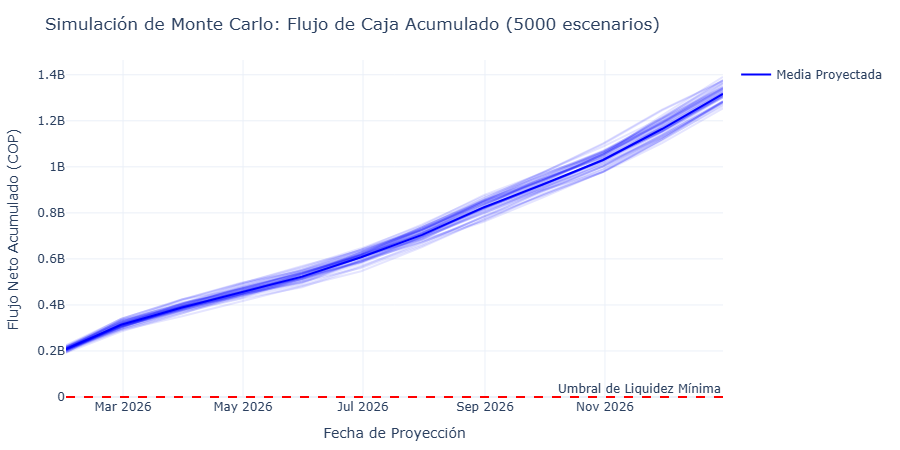

---

### Distribución del Saldo Final

  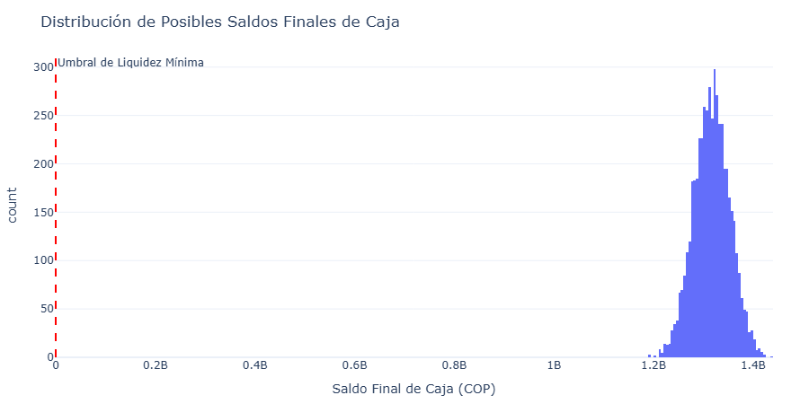

---

## 🧠 Interpretación Ejecutiva

- Flujo de caja proyectado consistentemente positivo  
- Riesgo de liquidez prácticamente nulo en el horizonte analizado  
- Alta resiliencia financiera ante escenarios adversos  
- Metodología robusta y replicable para análisis financiero predictivo  

---

## 🧰 Stack Tecnológico

  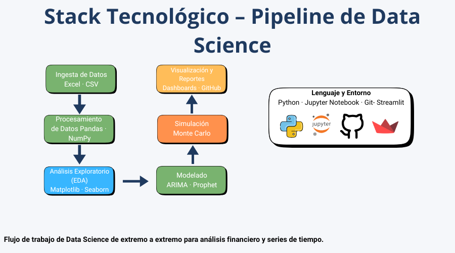

- **Python**
- pandas · numpy
- matplotlib · seaborn
- statsmodels
- prophet
- plotly express
- ARIMA
- Streamlit

---

